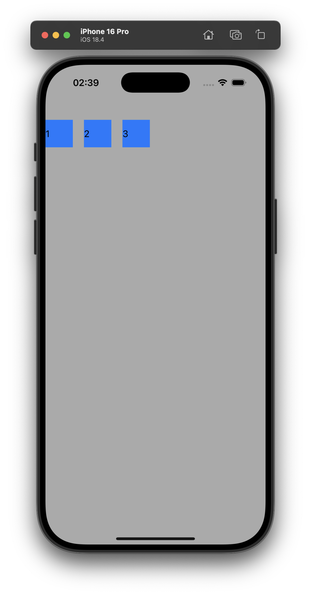
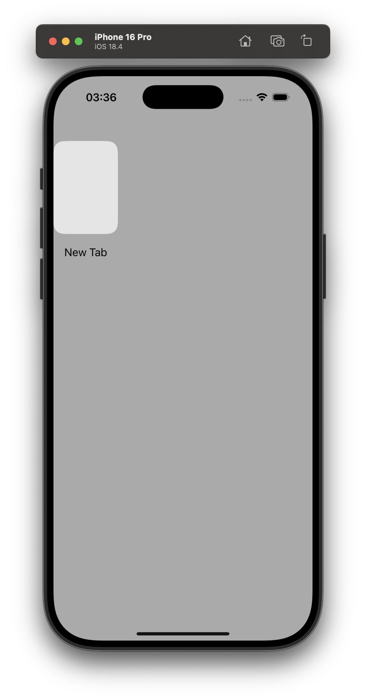

# Building a Safari-inspired Browser

In this tutorial, we'll be covering how one might go about architecting a Safari/Chrome
-inspired browser using UIKit. The goal of this tutorial is to go from the starter iOS 
application to a browser UI with collection views displaying a grid of tab snapshots and
ensuring that whenever a tab is clicked, a zoom animation converts that snapshot into a
full web view. 

## Table of Contents

1. Basic Project Setup
2. Programatically Displaying an (Empty) Collection View & Organizing Project
3. Displaying A Tab Cell in the Collection View

## Chapter 1: Basic Project Setup

To make this tutorial easier to follow, we'll be leveraging totally programmatic UI. This
chapter includes two steps:

1. Setting up an Xcode project to use programattic UI.
1. In my case, I'll also be comitting tutorial-related files (such as the project README,
documentation screenshots, etc.)

By the end of this chapter, you'll be able to run a storyboardless starter application.

### Step 1: Project Initialization

These steps should be familiar to anyone who's developed for iOS before.

1. Open Xcode.
1. Select "File > New > Project..." (alternatively, ⌘⇧N).
1. Configure the project with the following key settings 
([Figure 1.1](./Documentation/1.1_Project_Initialization.png)): 
    - **Product name:** Compass
    - **Interface:** Storyboard
    - **Language:** Swift
1. Do initialize a Git repository for this project.

### Step 2: Eliminating Storyboards

Configuring a storybaordless iOS application is a *very* common task. Hence, there are
many, many tutorials on this. If you're reading this in the future, I'd suggest you
look on YouTube for the most recent instructions on how to complete this. The steps
below are what I did and it worked for me at the time of publishing.

1. Right click on the Main.storyboard file and select "Delete" from the context menu. 
([Figure 1.2](./Documentation/1.2_Delete_Main_Dot_Storyboard.png))
1. In the confirmation dialog, select "Move to trash".
1. Open the "Info.plist" file.
1. Delete the key entitled "Storyboard Name". 
([Figure 1.3](./Documentation/1.3_Delete_Info_Dot_Plist_Key.png))
1. In the sidebar, click on the "Compass" Xcode project.
1. Delete the build setting entitled "UIKit Main Storyboard File Base Name". 
([Figure 1.4](./Documentation/1.4_Delete_Build_Setting.png))

Next, we must edit the "SceneDelegate.swift" file. In particular, replace the boilerplate 
implementation of the `func scene(...)` method with the following:

``` swift
func scene(
    _ scene: UIScene, 
    willConnectTo session: UISceneSession, 
    options connectionOptions: UIScene.ConnectionOptions
) {
    guard let windowScene = (scene as? UIWindowScene) else { return }
    let window = UIWindow(windowScene: windowScene)
    window.makeKeyAndVisible()
    window.rootViewController = ViewController()
    self.window = window
}
```

At this point, you should be able to run your app, and see a black screen. 
([Figure 1.5](./Documentation/1.5_Blank_Screen.png))

## Chapter 2: Programatically Displaying an (Empty) Collection View

Looking at a browser's UI, we can break it into several elements. We begin with a
collection view where each cell corresponds to a tab. When we click on a particular cell,
the corresponding webview is pushed onto a stack. Additionally, note that clicking a link
sometimes creates a new tab, and that new tab is 'activated' via a swiping page animation.
Additionally, in Safari at least, tabs don't start out by just loading a home page, they
display a view controller with your "Shared with You" links, "Favorites".
Hence, it seems we'll need the following:
1. A `UINavigationController` to push and pop other view controllers.
1. A `UICollectionViewController` to display tab cells.
1. A `UIPageViewController` to display the webview and transition to new webviews when
they're created.
1. A custom `UIViewController` to display a webview or home screen whenever appropriate.

In this chapter, we'll focus solely on creating the first two. We'll do this in keeping
with MVVM architecture.

### Step 1: Create the `RootNavigationVC` Class

1. Ensure the `ViewController` inherits from `UINavigationController`.
1. Rename the `ViewController` class to something more descriptive e.g. `RootNavigationVC`. 
([Figure 2.1](./Documentation/2.1_Rename_ViewController.png)).
1. Create a new folder named "Controllers" and drag the "RootNavigationVC.swift" file into
it.

### Step 2: Create the `TabCollectionVC` Class

1. Inside the "Controllers" folder, create a new Swift file called "TabCollectionVC.swift".
1. In that file, paste the following, which will simply make it easy to see:

``` swift
final class TabCollectionVC: UICollectionViewController {
    override func viewDidLoad() {
        collectionView.backgroundColor = .lightGray
    }
}
```

### Step 3: Configure the `RootNavigationVC` to Display the `TabCollectionVC`.

The `TabCollectionVC` should be the top-most controller of the `RootNavigationVC`. Hence,
we should have the `RootNavigationVC` create an instance of the `TabCollectionVC` and show
it. Note that to initialize a `UICollectionViewController`, the 
`UICollectionViewFlowLayout` can't be `nil`. Thus, we implement `RootNavigationVC` as
follows:

``` swift 
final class RootNavigationVC: UINavigationController {
    override func viewDidLoad() {
        super.viewDidLoad()
        let layout = UICollectionViewFlowLayout()
        let tabCollectionVC = TabCollectionVC(collectionViewLayout: layout)
        self.viewControllers = [tabCollectionVC]
    }   
}
```

If you were to run the application at this point, you should simply see a gray screen.
([Figure 2.2](./Documentation/2.2_Empty_Gray_CollectionView.png))

### Step 4: Implement Boilerplate for MVVM

Since this app will grow quite large, it'll be good to use MVVM architecture to organize
our code. We can get a head start on this by doing it now. Specifically, let's add some
boilerplate for the "`TabCollectionVM`" class. This class will be responsible for (at 
minimum):
- owning and modifying the `tabs` array which the `TabCollectionVC` displays.
- storing key data for the `tabs` array in persistent storage when the app closes.
- restoring the `tabs` array from persistent storage when the app opens.
- notifying the `TabCollectionVC` of view-relevant tab-related events. To be concrete, we
plan to implement a "Close All" button for the collection view. But this button should be
dimmed and untappable if the tabs array is already empty. Hence, the `TabCollectionVM`
would need to notify the `TabCollectionVC` if/once the array becomes empty.

1. Create a new file in the "Controllers" folder named "TabCollectionVM.swift".
2. Provide a (dummy) implementation of this class for now.
``` swift
final class TabCollectionVM {
    // TODO: Replace this dummy property with an actual array of `Tab` objects.
    var tabs = [1, 2, 3]
}
```
3. Modify the `TabCollectionVC` so that it instantiates a `TabCollectionVM`.
``` swift
final class TabCollectionVC: UICollectionViewController {
    var vm = TabCollectionVM()
    // ...
}
```

## Chapter 3: Displaying A Tab Cell in the Collection View

### Step 1: Displaying The Dummy, Numeric `tabs` Array in the Collection View with Default Cells

1. In the "TabCollectionVC.swift" file edit the `viewDidLoad` class to register a reuse 
identifier for the default `UICollectionViewCell` class. For the reuse identifier, it's
conventional to just use the class name. By the end of this chapter, we'll design a custom
cell subclass but for now we just need to focus the structure of the code right first:
``` swift
override func viewDidLoad() {
    // ...
    collectionView.register(
        UICollectionViewCell.self,
        forCellWithReuseIdentifier: String(describing: UICollectionViewCell.self)
    )
}
```
2. Next, we need to implement the "`numberOfItemsInSection`" method. We can do this as 
follows:
``` swift 
extension TabCollectionVC {
    override func collectionView(
        _ collectionView: UICollectionView,
        numberOfItemsInSection section: Int
    ) -> Int {
        return vm.tabs.count
    }
}
```
3. Finally, we need to implement the "`cellForItemAt`" method. I'm going to configure the
default collection view cell so that it displays the number from the `tabs` array:
``` swift
extension TabCollectionVC {
    override func collectionView(
        _ collectionView: UICollectionView,
        cellForItemAt indexPath: IndexPath
    ) -> UICollectionViewCell {
        // TODO: Replace with a custom view (`TabCell`) and configure the view in this method.
        let tabSnapshotCell = collectionView.dequeueReusableCell(
            withReuseIdentifier: String(describing: UICollectionViewCell.self),
            for: indexPath
        )
        tabSnapshotCell.contentView.backgroundColor = .systemBlue
        
        // For now `relevantTab`, this is just an integer since the `tabs` array is numeric.
        let relevantTab = vm.tabs[indexPath.item]
        let label = UILabel()
        label.text = String(relevantTab)
        label.frame = tabSnapshotCell.contentView.bounds
        tabSnapshotCell.contentView.addSubview(label)
        
        return tabSnapshotCell
    }
}
```

At this point, you should be able to run the application in the simulator and see three
blue cells each displaying the number from the `tabs` array.



### Step 2: Creating a `Tab` Class

Eventually, we want to fix the `tabs` array, so that it doesn't just hold integers. We 
need it to hold an array of `Tab` objects, so let's define that class. For now, the `Tab` 
class will be pretty basic but it'll grow in complexity and functionality as the tutorial 
goes on. For now, we'll just make each tab `Identifiable` and give it a title.

1. Create a "Models" folder.
1. In the "Models" folder, create a "Tab.swift" file.
1. Implement the `Tab` class as follows:
``` swift
final class Tab: Identifiable {
    var id: String
    var title: String
    init() {
        self.id = UUID().uuidString
        self.title = Tab.DEFAULT_TITLE
    }
}

// MARK: - Constants

extension Tab {
    private static let DEFAULT_TITLE = "New Tab"
}
```

### Step 3: Design a `TabCell` View

The exact way you design this view is up to you! For now, we'll just make an image view,
with a grayish background color and a corner radius. Below that image view will be a UILabel.

1. Create a "Views" folder.
1. In the "Views" folder, create a "TabCell.swift" file.
1. Implement the `TabCell` class as follows:
``` swift

final class TabCell: UICollectionViewCell {
    
    // MARK: - UI Components
    
    private lazy var snapshot: UIImageView = {
        let imageView = UIImageView()
        imageView.translatesAutoresizingMaskIntoConstraints = false
        imageView.layer.cornerRadius = TabCell.STANDARD_CORNER_RADIUS
        imageView.layer.masksToBounds = true
        imageView.backgroundColor = TabCell.BACKGROUND_COLOR
        imageView.isUserInteractionEnabled = true
        return imageView
    }()
    
    private lazy var titleLabel: UILabel = {
        let label = UILabel()
        label.translatesAutoresizingMaskIntoConstraints = false
        label.textAlignment = .center
        label.numberOfLines = 2
        return label
    }()
    
    var title: String? {
        get { titleLabel.text }
        set { titleLabel.text = newValue }
    }
    
    // MARK: - Initialization
    
    override init(frame: CGRect) {
        super.init(frame: frame)
        setupViews()
        setupConstraints()
    }
    
    required init?(coder: NSCoder) {
        fatalError("init(coder:) has not been implemented")
    }
    
    // MARK: - Setup
    
    private func setupViews() {
        contentView.addSubview(snapshot)
        contentView.addSubview(titleLabel)
        
        contentView.layer.cornerRadius = TabCell.STANDARD_CORNER_RADIUS
        contentView.layer.masksToBounds = true
        
    }
    
    private func setupConstraints() {
        NSLayoutConstraint.activate([
            snapshot.topAnchor.constraint(equalTo: contentView.topAnchor),
            snapshot.leadingAnchor.constraint(equalTo: contentView.leadingAnchor),
            snapshot.trailingAnchor.constraint(equalTo: contentView.trailingAnchor),
            snapshot.bottomAnchor.constraint(equalTo: titleLabel.topAnchor, constant: -8),
            
            titleLabel.leadingAnchor.constraint(equalTo: contentView.leadingAnchor, constant: 8),
            titleLabel.trailingAnchor.constraint(equalTo: contentView.trailingAnchor, constant: -8),
            titleLabel.bottomAnchor.constraint(equalTo: contentView.bottomAnchor, constant: -8),
            titleLabel.heightAnchor.constraint(greaterThanOrEqualToConstant: 40)
        ])
    }
    
    override func layoutSubviews() {
        super.layoutSubviews()
        layer.shadowColor = TabCell.SHADOW_COLOR
        layer.shadowRadius = TabCell.STANDARD_CORNER_RADIUS
        layer.shadowOpacity = TabCell.SHADOW_OPACITY
        layer.shadowPath = UIBezierPath(
            roundedRect: bounds,
            cornerRadius: contentView.layer.cornerRadius
        ).cgPath
    }
}

// MARK: - Constants

extension TabCell {
    
    static let STANDARD_CORNER_RADIUS: CGFloat = 16
    
    /// The background color for the TabCell which is visible when a snapshot does
    /// not exist.
    static let BACKGROUND_COLOR = UIColor(red: 0.9, green: 0.9, blue: 0.9, alpha: 1.0)

    /// The background color for the TabCell which is visible when a snapshot does
    /// not exist.
    static let BACKGROUND_COLOR = UIColor(red: 0.9, green: 0.9, blue: 0.9, alpha: 1.0)
    
    /// The color of the shadow which appears behind the TabCell
    static let SHADOW_COLOR = UIColor.gray.cgColor
    
    /// The opacity of the shadow which appears behind the TabCell
    static let SHADOW_OPACITY: Float = 0.1
}


```

### Step 4: Replace dummy code
1. Edit the `tabs` array to use the `Tab` class:
``` diff
- var tabs = [1, 2, 3]
+ var tabs = [Tab()]
```
2. Replace the dummy code which registered a reuse identifier for the default 
`UICollectionViewCell` with code that registers a reuse identifier for our custom view. As
before, use the class name as the reuse identifier:
``` diff
collectionView.register(
-    UICollectionViewCell.self,
-    forCellWithReuseIdentifier: String(describing: UICollectionViewCell.self)
+    TabCell.self,
+    forCellWithReuseIdentifier: String(describing: TabCell.self)
)
```
3. Edit the "`cellForItemAt`" function as follows:
``` swift
override func collectionView(
    _ collectionView: UICollectionView,
    cellForItemAt indexPath: IndexPath
) -> UICollectionViewCell {
    let tabSnapshotCell = collectionView.dequeueReusableCell(
        withReuseIdentifier: String(describing: TabCell.self),
        for: indexPath
    ) as! TabCell
    
    let relevantTab = vm.tabs[indexPath.item]
    
    // TODO: Don't hard code the frame. Use `sizeForItemAt` method.
    tabSnapshotCell.frame = CGRect(x: 0, y: 0, width: 100, height: 200)
    tabSnapshotCell.title = relevantTab.title
    
    return tabSnapshotCell
}
```

At this point, you should be able to run the application and see a `TabCell` displayed.



But note that we've hard coded the frame of the `TabCell`. So if you were to push more
`Tab`s to the `tabs` array, they'd all overlap in the collection view. 
([Figure 3.3](./Documentation/3.3_TabCells_Overlap.png)) We'll address that in the next 
chapter.
