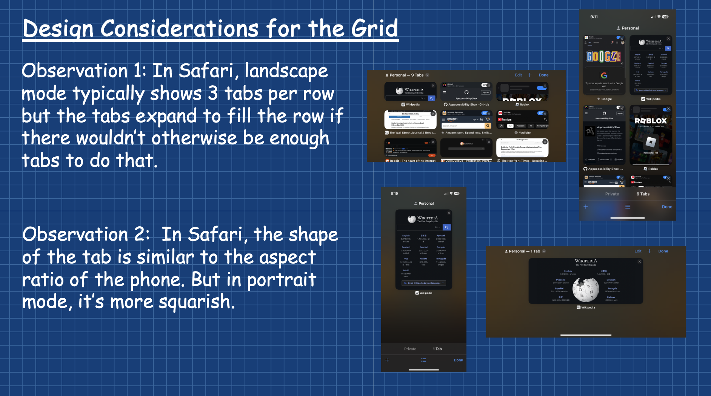
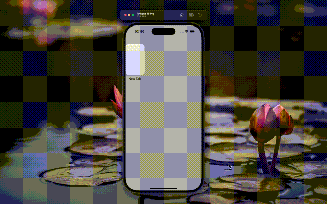
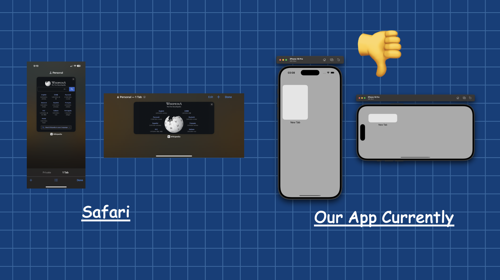
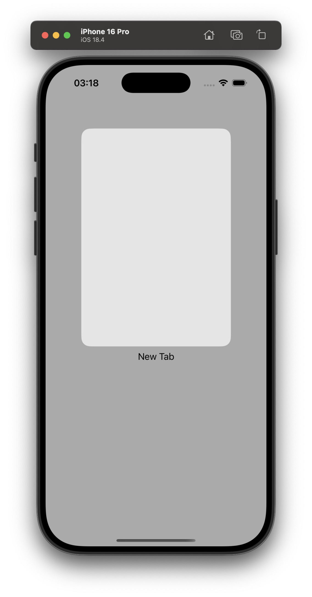
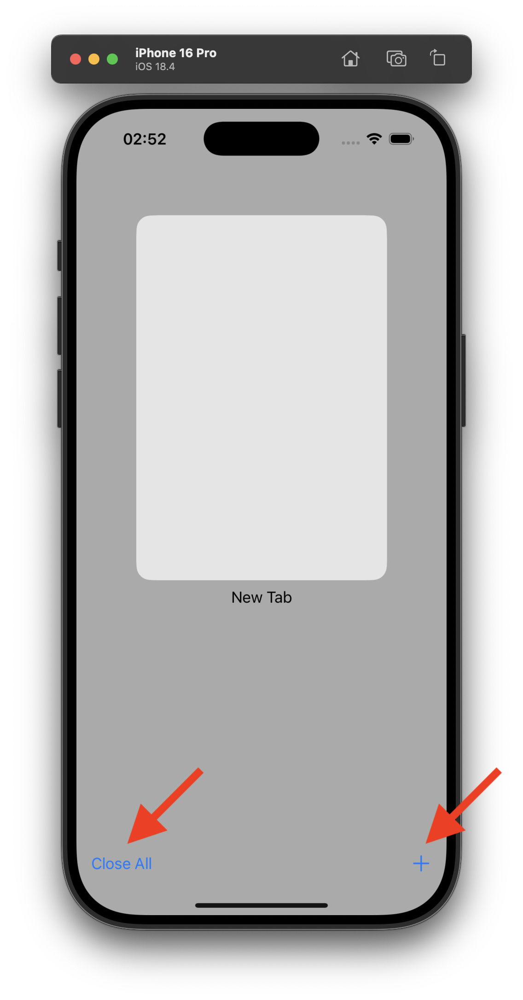
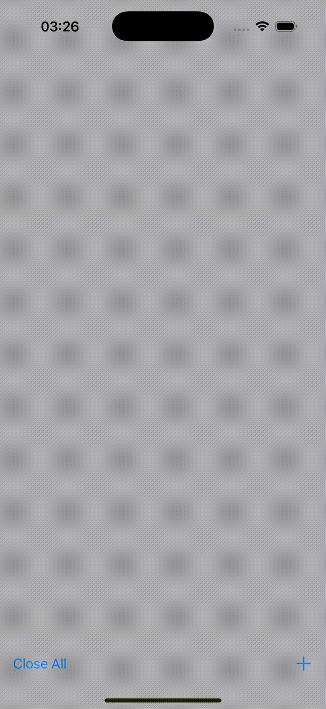
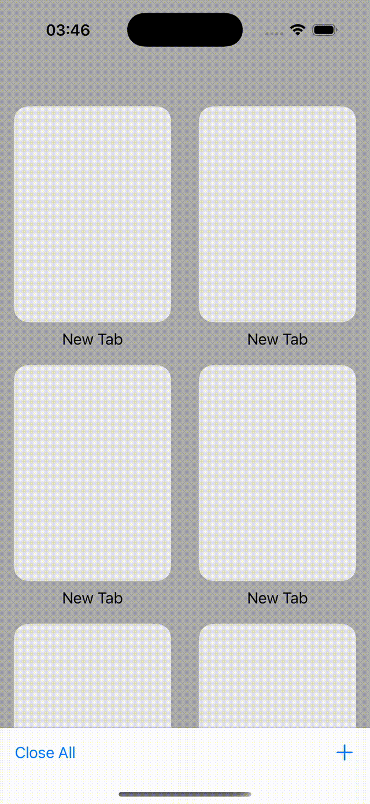
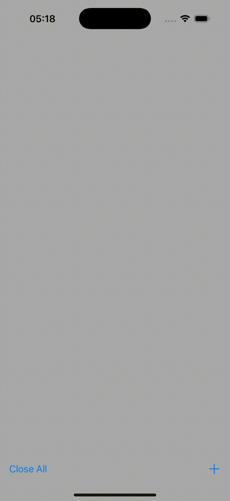

# Building a Safari-inspired Browser

In this tutorial, we'll be covering how one might go about architecting a Safari/Chrome
-inspired browser using UIKit. The goal of this tutorial is to go from the starter iOS 
application to a browser UI with collection views displaying a grid of tab snapshots and
ensuring that whenever a tab is clicked, a zoom animation converts that snapshot into a
full web view. 

## Table of Contents

1. Basic Project Setup
2. Programatically Displaying an (Empty) Collection View & Organizing Project
3. Displaying A Tab Cell in the Collection View
4. Implementing a Beautiful, Safari-Inspired Collection View Grid
5. Adding Toolbar Buttons to Add and Close All Tabs

## Chapter 1: Basic Project Setup

To make this tutorial easier to follow, we'll be leveraging totally programmatic UI. This
chapter includes two steps:

1. Setting up an Xcode project to use programattic UI.
1. In my case, I'll also be comitting tutorial-related files (such as the project README,
documentation screenshots, etc.)

By the end of this chapter, you'll be able to run a storyboardless starter application.

### Step 1: Project Initialization

These steps should be familiar to anyone who's developed for iOS before.

1. Open Xcode.
1. Select "File > New > Project..." (alternatively, ⌘⇧N).
1. Configure the project with the following key settings 
([Figure 1.1](./Documentation/1.1_Project_Initialization.png)): 
    - **Product name:** Compass
    - **Interface:** Storyboard
    - **Language:** Swift
1. Do initialize a Git repository for this project.

### Step 2: Eliminating Storyboards

Configuring a storybaordless iOS application is a *very* common task. Hence, there are
many, many tutorials on this. If you're reading this in the future, I'd suggest you
look on YouTube for the most recent instructions on how to complete this. The steps
below are what I did and it worked for me at the time of publishing.

1. Right click on the Main.storyboard file and select "Delete" from the context menu. 
([Figure 1.2](./Documentation/1.2_Delete_Main_Dot_Storyboard.png))
1. In the confirmation dialog, select "Move to trash".
1. Open the "Info.plist" file.
1. Delete the key entitled "Storyboard Name". 
([Figure 1.3](./Documentation/1.3_Delete_Info_Dot_Plist_Key.png))
1. In the sidebar, click on the "Compass" Xcode project.
1. Delete the build setting entitled "UIKit Main Storyboard File Base Name". 
([Figure 1.4](./Documentation/1.4_Delete_Build_Setting.png))

Next, we must edit the "SceneDelegate.swift" file. In particular, replace the boilerplate 
implementation of the `func scene(...)` method with the following:

``` swift
func scene(
    _ scene: UIScene, 
    willConnectTo session: UISceneSession, 
    options connectionOptions: UIScene.ConnectionOptions
) {
    guard let windowScene = (scene as? UIWindowScene) else { return }
    let window = UIWindow(windowScene: windowScene)
    window.makeKeyAndVisible()
    window.rootViewController = ViewController()
    self.window = window
}
```

At this point, you should be able to run your app, and see a black screen. 
([Figure 1.5](./Documentation/1.5_Blank_Screen.png))

## Chapter 2: Programatically Displaying an (Empty) Collection View

Looking at a browser's UI, we can break it into several elements. We begin with a
collection view where each cell corresponds to a tab. When we click on a particular cell,
the corresponding webview is pushed onto a stack. Additionally, note that clicking a link
sometimes creates a new tab, and that new tab is 'activated' via a swiping page animation.
Additionally, in Safari at least, tabs don't start out by just loading a home page, they
display a view controller with your "Shared with You" links, "Favorites".
Hence, it seems we'll need the following:
1. A `UINavigationController` to push and pop other view controllers.
1. A `UICollectionViewController` to display tab cells.
1. A `UIPageViewController` to display the webview and transition to new webviews when
they're created.
1. A custom `UIViewController` to display a webview or home screen whenever appropriate.

In this chapter, we'll focus solely on creating the first two. We'll do this in keeping
with MVVM architecture.

### Step 1: Create the `RootNavigationVC` Class

1. Ensure the `ViewController` inherits from `UINavigationController`.
1. Rename the `ViewController` class to something more descriptive e.g. `RootNavigationVC`. 
([Figure 2.1](./Documentation/2.1_Rename_ViewController.png)).
1. Create a new folder named "Controllers" and drag the "RootNavigationVC.swift" file into
it.

### Step 2: Create the `TabCollectionVC` Class

1. Inside the "Controllers" folder, create a new Swift file called "TabCollectionVC.swift".
1. In that file, paste the following, which will simply make it easy to see:

``` swift
final class TabCollectionVC: UICollectionViewController {
    override func viewDidLoad() {
        collectionView.backgroundColor = .lightGray
    }
}
```

### Step 3: Configure the `RootNavigationVC` to Display the `TabCollectionVC`.

The `TabCollectionVC` should be the top-most controller of the `RootNavigationVC`. Hence,
we should have the `RootNavigationVC` create an instance of the `TabCollectionVC` and show
it. Note that to initialize a `UICollectionViewController`, the 
`UICollectionViewFlowLayout` can't be `nil`. Thus, we implement `RootNavigationVC` as
follows:

``` swift 
final class RootNavigationVC: UINavigationController {
    override func viewDidLoad() {
        super.viewDidLoad()
        let layout = UICollectionViewFlowLayout()
        let tabCollectionVC = TabCollectionVC(collectionViewLayout: layout)
        self.viewControllers = [tabCollectionVC]
    }   
}
```

If you were to run the application at this point, you should simply see a gray screen.
([Figure 2.2](./Documentation/2.2_Empty_Gray_CollectionView.png))

### Step 4: Implement Boilerplate for MVVM

Since this app will grow quite large, it'll be good to use MVVM architecture to organize
our code. We can get a head start on this by doing it now. Specifically, let's add some
boilerplate for the "`TabCollectionVM`" class. This class will be responsible for (at 
minimum):
- owning and modifying the `tabs` array which the `TabCollectionVC` displays.
- storing key data for the `tabs` array in persistent storage when the app closes.
- restoring the `tabs` array from persistent storage when the app opens.
- notifying the `TabCollectionVC` of view-relevant tab-related events. To be concrete, we
plan to implement a "Close All" button for the collection view. But this button should be
dimmed and untappable if the tabs array is already empty. Hence, the `TabCollectionVM`
would need to notify the `TabCollectionVC` if/once the array becomes empty.

1. Create a new file in the "Controllers" folder named "TabCollectionVM.swift".
2. Provide a (dummy) implementation of this class for now.
``` swift
final class TabCollectionVM {
    // TODO: Replace this dummy property with an actual array of `Tab` objects.
    var tabs = [1, 2, 3]
}
```
3. Modify the `TabCollectionVC` so that it instantiates a `TabCollectionVM`.
``` swift
final class TabCollectionVC: UICollectionViewController {
    var vm = TabCollectionVM()
    // ...
}
```

## Chapter 3: Displaying A Tab Cell in the Collection View

### Step 1: Displaying The Dummy, Numeric `tabs` Array in the Collection View with Default Cells

1. In the "TabCollectionVC.swift" file edit the `viewDidLoad` class to register a reuse 
identifier for the default `UICollectionViewCell` class. For the reuse identifier, it's
conventional to just use the class name. By the end of this chapter, we'll design a custom
cell subclass but for now we just need to focus the structure of the code right first:
``` swift
override func viewDidLoad() {
    // ...
    collectionView.register(
        UICollectionViewCell.self,
        forCellWithReuseIdentifier: String(describing: UICollectionViewCell.self)
    )
}
```
2. Next, we need to implement the "`numberOfItemsInSection`" method. We can do this as 
follows:
``` swift 
extension TabCollectionVC {
    override func collectionView(
        _ collectionView: UICollectionView,
        numberOfItemsInSection section: Int
    ) -> Int {
        return vm.tabs.count
    }
}
```
3. Finally, we need to implement the "`cellForItemAt`" method. I'm going to configure the
default collection view cell so that it displays the number from the `tabs` array:
``` swift
extension TabCollectionVC {
    override func collectionView(
        _ collectionView: UICollectionView,
        cellForItemAt indexPath: IndexPath
    ) -> UICollectionViewCell {
        // TODO: Replace with a custom view (`TabCell`) and configure the view in this method.
        let tabSnapshotCell = collectionView.dequeueReusableCell(
            withReuseIdentifier: String(describing: UICollectionViewCell.self),
            for: indexPath
        )
        tabSnapshotCell.contentView.backgroundColor = .systemBlue
        
        // For now `relevantTab`, this is just an integer since the `tabs` array is numeric.
        let relevantTab = vm.tabs[indexPath.item]
        let label = UILabel()
        label.text = String(relevantTab)
        label.frame = tabSnapshotCell.contentView.bounds
        tabSnapshotCell.contentView.addSubview(label)
        
        return tabSnapshotCell
    }
}
```

At this point, you should be able to run the application in the simulator and see three
blue cells each displaying the number from the `tabs` array.


### Step 2: Creating a `Tab` Class

Eventually, we want to fix the `tabs` array, so that it doesn't just hold integers. We 
need it to hold an array of `Tab` objects, so let's define that class. For now, the `Tab` 
class will be pretty basic but it'll grow in complexity and functionality as the tutorial 
goes on. For now, we'll just make each tab `Identifiable` and give it a title.

1. Create a "Models" folder.
1. In the "Models" folder, create a "Tab.swift" file.
1. Implement the `Tab` class as follows:
``` swift
final class Tab: Identifiable {
    var id: String
    var title: String
    init() {
        self.id = UUID().uuidString
        self.title = Tab.DEFAULT_TITLE
    }
}

// MARK: - Constants

extension Tab {
    private static let DEFAULT_TITLE = "New Tab"
}
```

### Step 3: Design a `TabCell` View

The exact way you design this view is up to you! For now, we'll just make an image view,
with a grayish background color and a corner radius. Below that image view will be a UILabel.

1. Create a "Views" folder.
1. In the "Views" folder, create a "TabCell.swift" file.
1. Implement the `TabCell` class as follows:
``` swift

final class TabCell: UICollectionViewCell {
    
    // MARK: - UI Components
    
    private lazy var snapshot: UIImageView = {
        let imageView = UIImageView()
        imageView.translatesAutoresizingMaskIntoConstraints = false
        imageView.layer.cornerRadius = TabCell.STANDARD_CORNER_RADIUS
        imageView.layer.masksToBounds = true
        imageView.backgroundColor = TabCell.BACKGROUND_COLOR
        imageView.isUserInteractionEnabled = true
        return imageView
    }()
    
    private lazy var titleLabel: UILabel = {
        let label = UILabel()
        label.translatesAutoresizingMaskIntoConstraints = false
        label.textAlignment = .center
        label.numberOfLines = 2
        return label
    }()
    
    var title: String? {
        get { titleLabel.text }
        set { titleLabel.text = newValue }
    }
    
    // MARK: - Initialization
    
    override init(frame: CGRect) {
        super.init(frame: frame)
        setupViews()
        setupConstraints()
    }
    
    required init?(coder: NSCoder) {
        fatalError("init(coder:) has not been implemented")
    }
    
    // MARK: - Setup
    
    private func setupViews() {
        contentView.addSubview(snapshot)
        contentView.addSubview(titleLabel)
        
        contentView.layer.cornerRadius = TabCell.STANDARD_CORNER_RADIUS
        contentView.layer.masksToBounds = true
        
    }
    
    private func setupConstraints() {
        NSLayoutConstraint.activate([
            snapshot.topAnchor.constraint(equalTo: contentView.topAnchor),
            snapshot.leadingAnchor.constraint(equalTo: contentView.leadingAnchor),
            snapshot.trailingAnchor.constraint(equalTo: contentView.trailingAnchor),
            snapshot.bottomAnchor.constraint(equalTo: titleLabel.topAnchor, constant: -8),
            
            titleLabel.leadingAnchor.constraint(equalTo: contentView.leadingAnchor, constant: 8),
            titleLabel.trailingAnchor.constraint(equalTo: contentView.trailingAnchor, constant: -8),
            titleLabel.bottomAnchor.constraint(equalTo: contentView.bottomAnchor, constant: -8),
            titleLabel.heightAnchor.constraint(greaterThanOrEqualToConstant: 40)
        ])
    }
    
    override func layoutSubviews() {
        super.layoutSubviews()
        layer.shadowColor = TabCell.SHADOW_COLOR
        layer.shadowRadius = TabCell.STANDARD_CORNER_RADIUS
        layer.shadowOpacity = TabCell.SHADOW_OPACITY
        layer.shadowPath = UIBezierPath(
            roundedRect: bounds,
            cornerRadius: contentView.layer.cornerRadius
        ).cgPath
    }
}

// MARK: - Constants

extension TabCell {
    
    static let STANDARD_CORNER_RADIUS: CGFloat = 16
    
    /// The background color for the TabCell which is visible when a snapshot does
    /// not exist.
    static let BACKGROUND_COLOR = UIColor(red: 0.9, green: 0.9, blue: 0.9, alpha: 1.0)

    /// The background color for the TabCell which is visible when a snapshot does
    /// not exist.
    static let BACKGROUND_COLOR = UIColor(red: 0.9, green: 0.9, blue: 0.9, alpha: 1.0)
    
    /// The color of the shadow which appears behind the TabCell
    static let SHADOW_COLOR = UIColor.gray.cgColor
    
    /// The opacity of the shadow which appears behind the TabCell
    static let SHADOW_OPACITY: Float = 0.1
}


```

### Step 4: Replace dummy code
1. Edit the `tabs` array to use the `Tab` class:
``` diff
- var tabs = [1, 2, 3]
+ var tabs = [Tab()]
```
2. Replace the dummy code which registered a reuse identifier for the default 
`UICollectionViewCell` with code that registers a reuse identifier for our custom view. As
before, use the class name as the reuse identifier:
``` diff
collectionView.register(
-    UICollectionViewCell.self,
-    forCellWithReuseIdentifier: String(describing: UICollectionViewCell.self)
+    TabCell.self,
+    forCellWithReuseIdentifier: String(describing: TabCell.self)
)
```
3. Edit the "`cellForItemAt`" function as follows:
``` swift
override func collectionView(
    _ collectionView: UICollectionView,
    cellForItemAt indexPath: IndexPath
) -> UICollectionViewCell {
    let tabSnapshotCell = collectionView.dequeueReusableCell(
        withReuseIdentifier: String(describing: TabCell.self),
        for: indexPath
    ) as! TabCell
    
    let relevantTab = vm.tabs[indexPath.item]
    
    // TODO: Don't hard code the frame. Use `sizeForItemAt` method.
    tabSnapshotCell.frame = CGRect(x: 0, y: 0, width: 100, height: 200)
    tabSnapshotCell.title = relevantTab.title
    
    return tabSnapshotCell
}
```

At this point, you should be able to run the application and see a `TabCell` displayed.


But note that we've hard coded the frame of the `TabCell`. So if you were to push more
`Tab`s to the `tabs` array, they'd all overlap in the collection view. 
([Figure 3.3](./Documentation/3.3_TabCells_Overlap.png)) We'll address that in the next 
chapter.

## Chapter 4: Implementing a Beautiful, Safari-Inspired Collection View Grid

In Chapter 3, we temporarily hard-coded the TabCell's frame just to make it visible. Now, 
we'll create a proper grid layout that mirrors Safari's tab view. Let's first analyze 
Safari's key design patterns:

### Dynamic Aspect Ratios

Unlike many grid layouts, Safari's tab cells don't maintain a fixed aspect ratio. Instead, 
they adapt to the device's orientation:
- In portrait mode, cells are taller and more square-like
- In landscape mode, cells are wider and more rectangular

### Adaptive Grid Layout

The grid's structure responds to both orientation and content:
- In portrait mode, there are 2 cells per row
- In landscape mode, there are 3 cells per row
- **Special case:** When displaying fewer cells than a full row (1-2 cells), each cell 
  expands to fill more space, creating a balanced layout

The following figure illustrates these layout patterns:



The key to implementing both behaviors lies in a single UICollectionViewController method: 
`collectionView(_:layout:sizeForItemAt:)`. This method not only controls our dynamic 
aspect ratios, but also—perhaps surprisingly—handles our adaptive grid layout.

By carefully calculating the cell sizes, we can let UICollectionView's natural flow 
behavior handle the row wrapping. That is, if we, size cells to occupy half the available 
width when in portrait and one-third the available width in landscape, the collection view
will automatically wrap to a new row when there's insufficient space, creating our desired
2-column and 3-column grids without additional configuration.

### Step 1: Create Orientation Enum

As discussed previously, portrait vs landscape orientation is essential to this UI. To
begin to model this, we'll use an enum.
1. In the "Models" folder, create a file called "Orientation.swift".
2. Implement the enum as follows:
``` swift
enum Orientation {
    case landscape
    case portrait
}
```

### Step 2: Define `orientation` Computed Property for Collection View

1. Create a folder called "Extensions".
2. In the "Extensions" folder, create a file called "UICollectionView+Extensions.swift".
3. In the "UICollectionView+Extensions.swift" file, define a computed property which
returns the orientation the collection view is by comparing its height and width.
``` swift
extension UICollectionView {
    var orientation: Orientation {
        return bounds.width > bounds.height ? .landscape : .portrait
    }
}
```

### Step 3: Ensure Layout Is Recomputed In Response to Device Rotation

Since the flow layout will need to change when the screen rotates, we'll need to listen
for rotation events and handle them by invalidating the layout. Do so by overriding the
`viewWillTransition(to:with:)` method like so:

``` swift
override func viewWillTransition(
    to size: CGSize,
    with coordinator: UIViewControllerTransitionCoordinator
) {
    super.viewWillTransition(to: size, with: coordinator)
    coordinator.animate(alongsideTransition: { _ in
        if let layout = self.collectionView.collectionViewLayout as? UICollectionViewFlowLayout {
            layout.invalidateLayout()
            self.collectionView.layoutIfNeeded()
        }
    })
}
```

### Step 4: Define Edge Insets for Collection View

1. Define the following constant:
``` swift
extension TabCollectionVC {
    private static let INSET_PADDING: CGFloat = 15
}
```
2. Implement the `UICollectionViewController`'s "`insetForSectionAt`" method like so:
``` swift
func collectionView(
    _ collectionView: UICollectionView,
    layout collectionViewLayout: UICollectionViewLayout,
    insetForSectionAt index: NSInteger
) -> UIEdgeInsets {
    UIEdgeInsets(
        top: TabCollectionVC.INSET_PADDING,
        left: collectionView.safeAreaInsets.left + TabCollectionVC.INSET_PADDING,
        bottom: TabCollectionVC.INSET_PADDING,
        right: collectionView.safeAreaInsets.right + TabCollectionVC.INSET_PADDING
    )
}
```

### Step 5: Define `itemsPerRow` Helper Function

As discussed previously, the number of items we want to display in each row depends on
both the orientation and the number of items in the `tabs` array. The following
implementation captures the desired behavior and can be used later.

``` swift
private func itemsPerRow(
    forOrientation orientation: Orientation, 
    andTabCount tabCount: Int
) -> CGFloat {
    if (tabCount == 1 || tabCount == 2) { return CGFloat(tabCount) }
    switch orientation {
    case .portrait:
        return 2
    case .landscape:
        return 3
    }
}
```


### Step 6: Calculating Width in the "`sizeForItemAt`" Method (Phase 1)

As mentioned at the outset of this chapeter, our main goal is to implement the 
"`sizeForItemAt`" method. Let's break the remaining work into distinct phases. In the 
first phase, we'll write a preliminary version of the "`sizeForItemAt`" function we need 
that accounts for the width, but not the height. Since the width is what determines the 
number of items in each row, this first iteration of the function will acheive the 
"Adaptive Grid Layout" effect. We won't account for the height. We'll just set the height
equal to the width so that each cell has the bounds of a square.

``` swift
func collectionView(
    _ collectionView: UICollectionView,
    layout collectionViewLayout: UICollectionViewLayout,
    sizeForItemAt indexPath: IndexPath
) -> CGSize {
    let orientation = collectionView.orientation
    let safeAreaWidth = collectionView.safeAreaLayoutGuide.layoutFrame.width
    
    let rowItemCount = itemsPerRow(
        forOrientation: orientation,
        andTabCount: collectionView.numberOfItems(inSection: 0)
    )
    let interItemSpacing = TabCollectionVC.INSET_PADDING * CGFloat(2 * rowItemCount)
    let itemWidth = (safeAreaWidth - interItemSpacing) / rowItemCount
    
    // TODO: Actually compute height to achieve "dynamic aspect ratios" in the next phase.
    let itemHeight = itemWidth
    
    return CGSize(width: itemWidth, height: itemHeight)
}
```

At this point, you should be able to run the project in the simulator and see that when
the device is in portrait mode, each grid row has two cells, and in landscape mode, each
grid row has three cells.


One other thing to note is that there was a bit of a sizing issue when we first run the
app. That's because we haven't yet removed the code to hard-code the cell size. We'll do
that once we've completely phase 2.

### Step 7: Calculating Height in the "`sizeForItemAt`" Method (Phase 2)

Now that we have calculated the right width of each `TabCell`, it's pretty trivial to 
calculate a height which will give us the "Dynamic Aspect Ratios" effect. Doing so gives
us the second and complete iteration of the "`sizeForItemAt`" Method.

``` swift
func collectionView(
    _ collectionView: UICollectionView,
    layout collectionViewLayout: UICollectionViewLayout,
    sizeForItemAt indexPath: IndexPath
) -> CGSize {
    let orientation = collectionView.orientation
    let safeAreaWidth = collectionView.safeAreaLayoutGuide.layoutFrame.width
    
    let rowItemCount = itemsPerRow(
        forOrientation: orientation,
        andTabCount: collectionView.numberOfItems(inSection: 0)
    )
    let interItemSpacing = TabCollectionVC.INSET_PADDING * CGFloat(2 * rowItemCount)
    let itemWidth = (safeAreaWidth - interItemSpacing) / rowItemCount
    
    let deviceAspectRatio = collectionView.bounds.height / collectionView.bounds.width
    let squareAspectRatio = 1.0
    let squarifiedAspectRatio = (squareAspectRatio + deviceAspectRatio) / 2
    let aspectRatio = orientation == .portrait ? squarifiedAspectRatio : deviceAspectRatio
    
    let itemHeight = itemWidth * aspectRatio
        
    return CGSize(width: itemWidth, height: itemHeight)
}
```

Recall our observation that "In portrait mode, cells are taller and more square-like". One
cute trick leveraged in the above implementation to acheive a more square-like look was
to average the device's aspect ratio with a square's aspect ratio (i.e. 1.0).

At this point, the app should resemble the following:



### Step 8: Addressing Initial Sizing Glitch

Remove the line `tabSnapshotCell.frame = CGRect(x: 0, y: 0, width: 100, height: 200)` from
the `collectionView(_,numberOfItemsInSection)` method. This should address the glitch
observed on first application launch.

### Step 9: Improve `itemsPerRow` Helper Function to Handle Special Cases

Currently, the `itemsPerRow` function doesn't actually use the `tabCount` parameter passed
into it. This means we are not handling the "special cases" described at the outset of
this chapter. For instance, when there is only one item in the `tabs` array, that tab 
should be bigger than it otherwise would be but it's not.



To address this, we can improve upon the `itemsPerRow` function as follows:

``` swift
private func itemsPerRow(for orientation: Orientation, and tabCount: Int) -> CGFloat {
    if (tabCount == 1) { return 1.33 }
    if (tabCount == 2) { return 2 }
    switch orientation {
    case .portrait:
        return 2
    case .landscape:
        return 3
    }
}
```

This allows us to handle the edge case where there's only one item in `tabs` more 
gracefully in the UI as demonstrated below:



## Chapter 5: Adding Toolbar Buttons to Add and Close All Tabs

In this chapter, we’ll add a toolbar with buttons to let users manage their tabs — 
specifically, a "+" button to open a new tab and a "Close All" button to remove all 
existing tabs.

These buttons should only appear when the `TabCollectionVC` is the top view controller in 
the navigation stack. Later on, when we push detail views (like a web page), we’ll show a 
different set of toolbar buttons for in-tab navigation (e.g., forward/back). For now, 
we’re focusing on actions relevant to the tab grid view.

We’ll stick to the MVVM architecture introduced earlier. That means:

- The view model (`TabCollectionVM`) will own and modify the tabs array.
- The view controller (`TabCollectionVC`) will handle only UI-related logic.

For example, if there are no open tabs, the “Close All” button should be disabled. The 
view model will detect that state and notify the view controller to update the UI 
accordingly.

### Step 1: Setup the UI Skeleton

1. Modify the `viewDidLoad` method for the `RootNavigationVC` class so that its toolbar is
not hidden like so:

``` swift
final class RootNavigationVC: UINavigationController {
    
    override func viewDidLoad() {
        // ...
        setToolbarHidden(false, animated: false)
    }
    
}
```

2. Add the following constants to the `TabCollectionVC`:

``` swift
private static let CLOSE_ALL_TABS_BUTTON_TEXT = "Close All"
private static let CREATE_NEW_TAB_BUTTON_IMAGE = UIImage(systemName: "plus")
```

3. Modify the `TabCollectionVC` so that you create several new `UIBarButtonItems`. For now, 
we'll leave the `action` as `nil` as we'll implement those actions later on in this 
chapter. You can acheive this as follows:

``` swift
final class TabCollectionVC: UICollectionViewController {
    // ...
    var createNewTabButton: UIBarButtonItem!
    var closeAllTabsButton: UIBarButtonItem!

    override func viewDidLoad() {
        // ...
        createNewTabButton = UIBarButtonItem(
            image: TabCollectionVC.CREATE_NEW_TAB_BUTTON_IMAGE,
            style: .plain,
            target: self,
            action: nil
        )
        
        closeAllTabsButton = UIBarButtonItem(
            title: TabCollectionVC.CLOSE_ALL_TABS_BUTTON_TEXT,
            style: .plain,
            target: self,
            action: nil
        )
    }
}
// ...
```

4. Create a spacer, which we'll use later to spread the buttons to opposite sides of the 
toolbar.

``` swift
final class TabCollectionVC: UICollectionViewController {
    // ...
    override func viewDidLoad() {
        // ...
        let spacer = UIBarButtonItem(
            barButtonSystemItem: .flexibleSpace,
            target: nil,
            action: nil
        )
    }
}
// ...
```

5. Now, we set the toolbar items for the `TabCollectionVC`.

``` swift
final class TabCollectionVC: UICollectionViewController {
    // ...
    override func viewDidLoad() {
        // ...
        toolbarItems = [
            closeAllTabsButton,
            spacer,
            createNewTabButton
        ]
    }
}
// ...
```

At this point, when you run the app, you should see the following:



Aesthetically, this is exactly what we want. But the buttons don't do anything yet so the
remainder of this chapter will focus on implementing that.

### Step 2: Implement the Create New Tab Button

One thing to note at the outset is that we need to both modify the `tabs` array but that
isn't sufficient to update the collection view with an additional view. Rather, we have to
do the additional step of calling the `UICollectionView`'s `insertItems(at:)` method. In
terms of our MVVM architecture, then, the `TabCollectionVM` will modify the `tabs` array
and the `TabCollectionVC` will call `insertItems(at:)` to update the view. Since 
`insertItems(at:)` takes an `IndexPath` as a parameter, we'll have the `TabCollectionVM`'s
method return that (and of course it'll be returning just the length of the `tabs` array
since we'll be appending the new tab to the end of the `tabs` array). Note that the 
`insertItems(at:)` method is the preferred way of getting the collection view to update, 
rather than `reloadData()`, when we know exactly where the update ocurred since 
`reloadData()` is not as performant.

1. Introduce a new function called `createNewTabButtonPressed`. We'll implement it in a bit
but for now just define the method signature:
``` swift
extension TabCollectionVC {
    @objc func createNewTabButtonPressed() {
        // TODO: Have `TabCollectionVM` update the `tabs` array.
        // TODO: Update the `collectionView` using `insertItem(at:)
    }
}
```

2. Add `createNewTabButtonPressed` as the `action` for the `createNewTabButton`:

``` swift
createNewTabButton = UIBarButtonItem(
    // ...
    action: #selector(createNewTabButtonPressed)
)
```

3. Define an `appendNewTabToTabsArray` function in the `TabCollectionVM` like so:

``` swift
extension TabCollectionVM {
    func appendNewTabToTabsArray() -> IndexPath {
        let newTab = Tab()
        tabs.append(newTab)
        
        let newTabIndexPath = IndexPath(item: tabs.count - 1, section: 0)
        return newTabIndexPath
    }
}
```

4. Call the `appendNewTabToTabsArray` method within `createNewTabButtonPressed`:
``` swift
extension TabCollectionVC {
    @objc func createNewTabButtonPressed() {
        let newTabIndexPath = vm.appendNewTabToTabsArray()
        // TODO: Update the `collectionView` using `insertItem(at:)
    }
}
```

5. Update the Collection View at the `IndexPath` where the `Tab` was added

``` swift
extension TabCollectionVC {
    @objc func createNewTabButtonPressed() {
        let newTabIndexPath = vm.appendNewTabToTabsArray()
        collectionView.insertItems(at: [newTabIndexPath])
    }
}
```

Now, when you run the application, you should see the "+" button is working as below:



### Step 3: Implement the Close All Tabs Button

To imlement the "Close All" button, we'll follow pretty much the same steps. In this case,
though, we'll use the `UICollectionView`'s `reloadData` method since all the tabs will be
gone.

1. Introduce a new function called `closeAllTabsButtonPressed`. We'll implement it in a bit
but for now just define the method signature:

``` swift
extension TabCollectionVC {
    @objc func closeAllTabsButtonPressed() {
        // TODO: Have `TabCollectionVM` update the `tabs` array.
        // TODO: Update the `collectionView` using `reloadData()
    }
}
```

2. Add `closeAllTabsButtonPressed` as the `action` for the `closeAllTabsButton`:

``` swift
closeAllTabsButton = UIBarButtonItem(
    // ...
    action: #selector(closeAllTabsButtonPressed)
)
```

3. Define a `closeAllTabs` function in the `TabCollectionVM` like so:

``` swift
extension TabCollectionVM {
    func closeAllTabs() {
        tabs = [Tab]()
    }
}
```

4. Call the `closeAllTabs` method within `closeAllTabsButtonPressed`:

``` swift
extension TabCollectionVC {
    @objc func closeAllTabsButtonPressed() {
        vm.closeAllTabs()
        // TODO: Update the `collectionView` using `reloadData()
    }
}
```

5. Update the Collection View based on the changed data

``` swift
extension TabCollectionVC {
    @objc func closeAllTabsButtonPressed() {
        vm.closeAllTabs()
        collectionView.reloadData()
    }
}
```

Now, when you run the application, you should see the "Close All" button is working as
below:



### Step 4: Disabling Close All Button When `tabs` is Empty

When no tabs exist, the "Close All" button is useless. Hence, we should disable that 
button. To do things like this, it's convenient to leverage the `didSet` method. Again,
we'll be leveraging MVVM. In order for the `TabCollectionVM` to notify the 
`TabCollectionVC` of view-relevant changes to the `tabs` array, the `TabCollectionVM` will
need a reference to the `TabCollectionVC`.

1. Edit the `TabCollectionVM` class so that it requires a reference to its view controller:
``` swift
final class TabCollectionVM {
    let vc: TabCollectionVC
    // ...
    init(vc: TabCollectionVC) {
        self.vc = vc
    }
}
```

2. Edit the code where `TabCollectionVC` instantiates a `TabCollectionVM` so that it gives
the view model a reference to itself. The earliest we can possibly set the `vm` is within
the `TabCollectionVC`'s initializer so let's just do it there (as opposed to within some
other method like `viewDidLoad`) to avoid any possibility of a crash. To do this, we'll
override the designated initializer.

``` diff
final class TabCollectionVC: UICollectionViewController {
-    var vm: TabCollectionVM()
+    var vm: TabCollectionVM!
    // ...
}
```

``` swift
final class TabCollectionVC: UICollectionViewController {
    // ...
    override init(collectionViewLayout: UICollectionViewLayout) {
        super.init(collectionViewLayout: collectionViewLayout)
        vm = TabCollectionVM(vc: self)
    }
    required init?(coder: NSCoder) {
        fatalError("init(coder:) has not been implemented")
    }
}
```

3. Implement view-update methods in the `TabCollectionVC`:
``` swift
extension TabCollectionVC {
    
    func tabsLengthIsZero() {
        closeAllTabsButton.isEnabled = false
    }
    
    func tabsLengthIsPositive() {
        closeAllTabsButton.isEnabled = true
    }
}
```

4. Invoke view-update methods in the `TabCollectionVM`:
``` swift
final class TabCollectionVM {
    // ...
    var tabs: [Tab] = [] {
        didSet {
            relayIfTabLengthIsPositiveOrZero()
        }
    }

    func relayIfTabLengthIsPositiveOrZero() {
        if tabs.count == 0 {
            vc.tabsLengthIsZero()
        } else {
            vc.tabsLengthIsPositive()
        }
    }
    // ...
}
```
At this point, you should be able to see it basically working except that, when the app is
launched, the state is not correct. 



This is because, `tabs` is set to be an empty array when the `TabCollectionVM` is 
initialized. This is because the `didSet` observer is not called when a property is first 
initialized. There are probably more elegant ways to address this edge case, but I'm 
choosing to address this by having the view controller emit an event to the view model 
whenever its `viewWillAppear` method is called. This way the view model can communicate 
any information which is relevant to the initial state of the views.

5. Implement a function called `tabCollectionVCWillAppear` in the `TabCollectionVM` which
will handle this event by relaying information about the tab state.
``` swift
extension TabCollectionVM {
    func tabCollectionVCWillAppear() {
        relayIfTabLengthIsPositiveOrZero()
    }
}
```

6. Override the `viewDidLoad` Method to invoke the VM's event handler
``` swift 
final class TabCollectionVC: UICollectionViewController {
    // ...
    override func viewWillAppear(_ animated: Bool) {
        super.viewWillAppear(animated)
        vm.tabCollectionVCWillAppear()
    }
    // ...
}
```

This addresses the glitch observed previously, so that the "Close All" button works
perfectly!